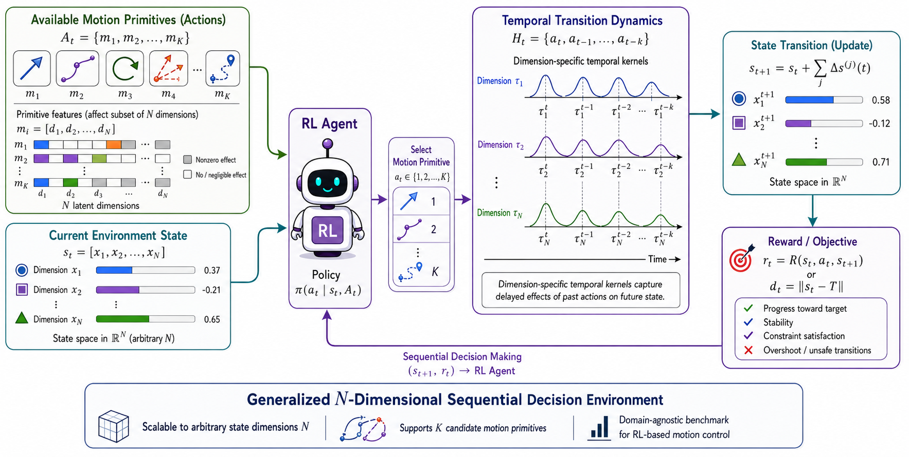

# NutriRL: *A Benchmark for Nutritional Regulation under Delayed State Transitions*

NutriRL is a nutrition-aware reinforcement learning benchmark for studying food-choice decisions under delayed nutrient absorption and long-horizon physiological goals. It is designed to support reproducible RL experiments and is aligned with the Reinforcement Learning Conference (RLC) paper workflow.

## Citation

If you use NutriRL in your research, please cite:

```bibtex
@article{khan2026nutrirl,
  title  = {NutriRL: A Benchmark for Nutritional Regulation under Delayed State Transitions},
  author = {Aniket Khan and Charitha Palika and V. Srinivasa Chakravarthy},
  year   = {2026},
  note   = {Preprint}
}
```

## Folder structure

```text
NutriRL/
├── agents/              # RL agents: PPO, DDQN, SAC, and AC-GAE
├── envs/                # Environment implementation
├── figures/             # Figures used in the project
├── foods_dataset/       # Food nutrient data
├── models/              # Neural network models
├── results/             # Training logs and plots
├── utils/               # Replay buffer, action helpers, and data utilities
├── experiments_all.csv  # Experiment configuration table
├── requirements.txt     # Python dependencies
├── run_ppo_all.ipynb    # PPO experiment notebook
├── run_ddqn_all.ipynb   # DDQN experiment notebook
├── run_sac_all.ipynb    # SAC experiment notebook
├── run_ac_gae_all.ipynb # AC-GAE experiment notebook
└── readme.md            # Project documentation
```

## Overview

This repository contains:

- A custom Gym-style environment for nutrition-based decision making,
- Multiple RL agents for comparison and benchmarking,
- Food datasets and experiment notebooks for training and evaluation,
- Utilities for replay buffers, actions, and environment state handling.

At a high level, NutriRL asks the agent to make food-choice decisions in a simulated body where the consequences of eating are not immediate. The agent must reason about future nutrient balance rather than only the immediate reward.

## Environment, agents, and dataset

The environment models nutrient intake for carbohydrates, fat, and protein, while introducing delayed digestion effects and target-based reward signals.



At each step, the agent observes its current internal state and the available food option, then chooses between skipping or consuming the food. When food is consumed, nutrients are absorbed gradually over time instead of being delivered instantly. This creates delayed effects, temporal dependencies, and long-horizon planning challenges.

The repository includes several RL agents for comparison:

- PPO
- DDQN
- SAC
- AC-GAE

The food data used for experiments are stored in the [foods_dataset](foods_dataset) folder.

## Why this environment is important

NutriRL is a useful benchmark for studying reinforcement learning in settings with:

- delayed effects,
- partial observability of internal states,
- long-horizon decision making,
- and reward signals tied to future physiological outcomes.

It is especially relevant for research at the intersection of RL, computational biology, and health-inspired decision systems.

## Installation

Install the required packages using the provided requirements file:

```bash
pip install -r requirements.txt
```

Example requirements:

```text
numpy
pandas
matplotlib
tqdm
torch
gymnasium
```

## How to run

1. Install the dependencies using the command above.
2. Open one of the experiment notebooks:
   - run_ppo_all.ipynb
   - run_ddqn_all.ipynb
   - run_sac_all.ipynb
   - run_ac_gae_all.ipynb
3. Choose an agent and experiment setting, then run the training pipeline.

## Summary
> NutriRL provides a practical environment to study how RL agents learn healthier, forward-looking food decisions under delayed physiological consequences.